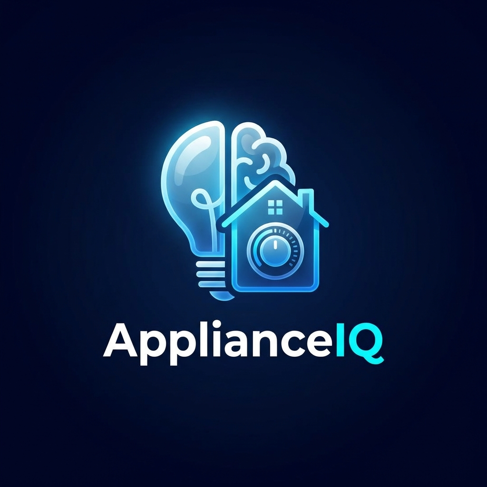
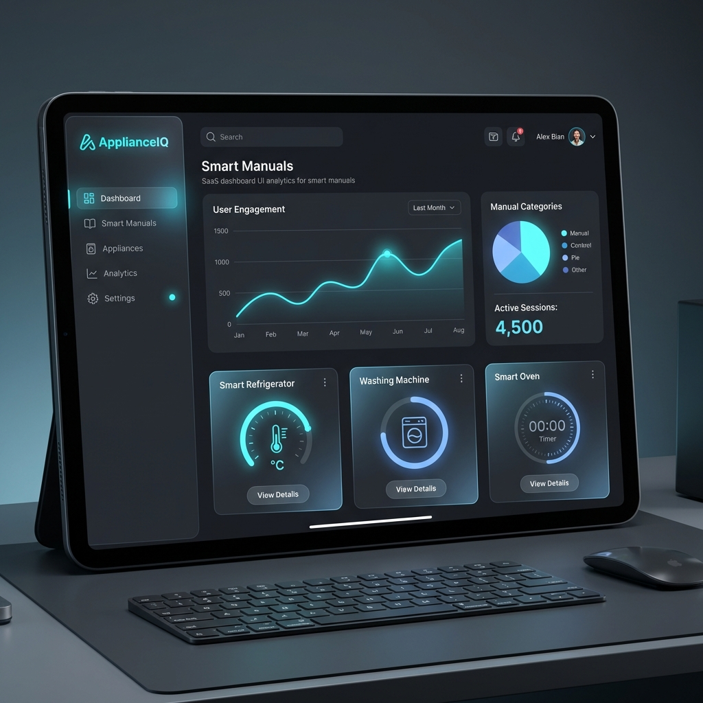

# ApplianceIQ: AI-Powered Smart Manual Management

<div align="center">
  
  <h3>Transforming User Manuals into Interactive Intelligent Assistants</h3>
  <p>
    
    
    
    
    
  </p>
</div>

---

## Quick Links
- [Getting Started](#getting-started)
- [Key Features](#key-features)
- [Tech Stack](#tech-stack)
- [Project Structure](#project-structure)
- [API Documentation](#api-documentation)
- [Contributing](#contributing)

---

## Overview

**ApplianceIQ** is a state-of-the-art AI platform designed to revolutionize how users interact with appliance manuals. By leveraging **Retrieval-Augmented Generation (RAG)** and advanced NLP, ApplianceIQ turns static PDFs into dynamic, conversational interfaces. 

No more flipping through hundreds of pages—just ask a question, and get an instant, accurate answer based on your specific appliance model.



---

## Key Features

- **Role-Based Access Control**: Secure login and signup for both **Administrators** and **Business Owners**.
- **Dynamic Dashboards**:
  - **Admin**: Oversee the entire ecosystem, manage users, and monitor system-wide manual uploads.
  - **Business Owner**: Manage individual appliance manuals, generate QR codes, and track user queries.
- **AI-Powered Chatbot**: Instant answers to technical questions using indexed manual data.
- **Smart Manual Ingestion**: Seamlessly upload and process PDF manuals with automated embedding generation.
- **QR Code Integration**: Generate unique QR codes for appliances that directly link customers to the interactive manual.
- **Graceful Degradation**: Robust architecture that remains functional even if secondary ML services are offline.

---

## Tech Stack

### Backend
- **Framework**: [FastAPI](https://fastapi.tiangolo.com/) (Python)
- **Database**: [MongoDB](https://www.mongodb.com/) (Motor Async Driver)
- **Vector Search**: [Qdrant](https://qdrant.tech/) (for high-performance RAG)
- **AI/ML**: Transformers, Embeddings, and NLP models.
- **Security**: JWT Authentication & Bcrypt password hashing.

### Frontend
- **Library**: [React.js](https://reactjs.org/)
- **Styling**: [Tailwind CSS](https://tailwindcss.com/)
- **UI Components**: [Radix UI](https://www.radix-ui.com/) & [Lucide Icons](https://lucide.dev/)
- **State Management**: React Hooks & Context API.

---

## Getting Started

### Prerequisites
- Python 3.9+
- Node.js 16+
- MongoDB instance (local or Atlas)

### 1. Clone the Repository
```bash
git clone https://github.com/tiirth22/Appliance_IQ.git
cd Appliance_IQ
```

### 2. Backend Setup
```bash
cd backend
python -m venv venv
# Windows
venv\Scripts\activate
# Linux/macOS
source venv/bin/activate

pip install -r requirements.txt
# Create a .env file based on the provided configuration
python server.py
```

### 3. Frontend Setup
```bash
cd frontend
npm install
npm start
```

---

## Project Structure

```text
.
├── backend/               # FastAPI Server logic
│   ├── auth.py            # JWT & Authentication
│   ├── models.py          # Pydantic & DB Models
│   ├── ingestion.py       # Document processing (optional)
│   ├── rag.py             # RAG Engine (Vector search)
│   ├── qr_handler.py      # QR code generation
│   └── server.py          # API Entry point
├── frontend/              # React Application
│   ├── src/pages/         # Dashboard & Auth views
│   ├── src/components/    # Reusable UI components
│   ├── src/hooks/         # Custom React hooks
│   └── src/lib/           # Utility functions
├── assets/                # README images & logos
├── tests/                 # API & Unit tests
└── docs/                  # Detailed documentation (deprecated)
```

---

## Implementation Status

### Backend (100%)
- [x] FastAPI server structure
- [x] MongoDB & Qdrant integration
- [x] Environment configuration
- [x] CORS & Middleware setup

### Authentication & Authorization (100%)
- [x] First-party signup/login
- [x] JWT Session tokens
- [x] Role-based access control (Admin/Business Owner)

### Frontend (100%)
- [x] Responsive Dashboards (Admin/Business Owner)
- [x] Interactive Chat Interface (RAG-ready)
- [x] Manual Upload & Management
- [x] Secure Auth Flow integration

### API Documentation

The backend provides a comprehensive API with Swagger documentation. Once the server is running, visit:
- **Swagger UI**: `http://localhost:8000/docs`
- **ReDoc**: `http://localhost:8000/redoc`

---

## Contributing

We welcome contributions! Please follow these steps:
1. Fork the Project.
2. Create your Feature Branch (`git checkout -b feature/AmazingFeature`).
3. Commit your Changes (`git commit -m 'Add some AmazingFeature'`).
4. Push to the Branch (`git push origin feature/AmazingFeature`).
5. Open a Pull Request.

---

## License

Distributed under the MIT License. See `LICENSE` for more information.

---

<p align="center">Made for a smarter home experience.</p>
