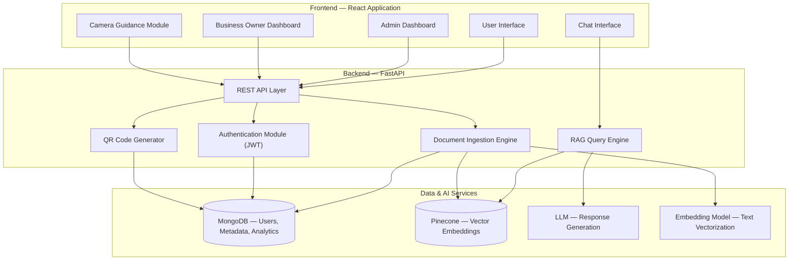
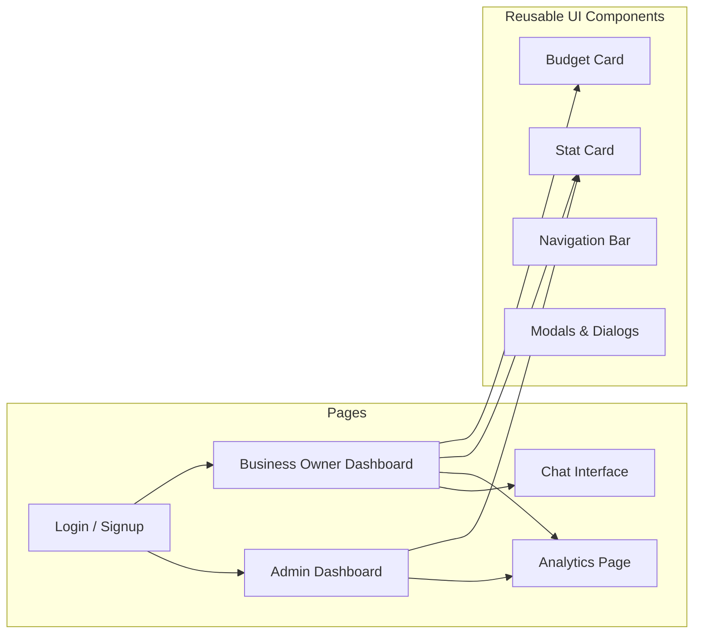
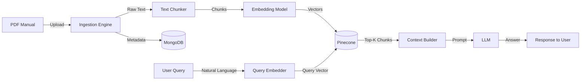
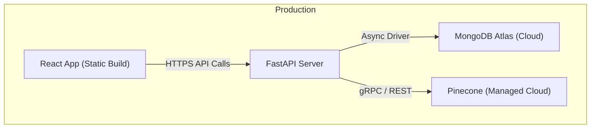
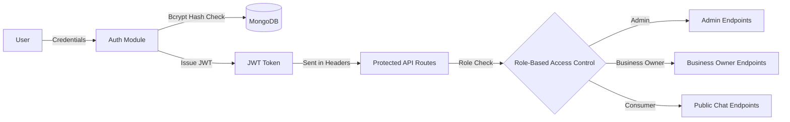

# ApplianceIQ — Project Architecture & Application Flow

---

## 1. High-Level System Architecture

The ApplianceIQ platform follows a **three-tier architecture** comprising a Frontend (Client), a Backend (API Server), and external Data & AI Services.

### Layer Descriptions

| Layer | Technology | Responsibility |
|---|---|---|
| **Frontend** | React.js, Tailwind CSS, Radix UI, Lucide Icons | User interaction, dashboards, chat UI, camera module |
| **Backend** | FastAPI (Python), Motor (async MongoDB driver) | API routing, authentication, document processing, RAG orchestration |
| **Data Storage** | MongoDB | User accounts, roles, manual metadata, query analytics |
| **Vector Database** | Pinecone | Storing and querying high-dimensional text embeddings for semantic search |
| **AI / ML** | Sentence Transformers, LLM | Generating embeddings from manual text; formulating natural language answers |

---

## 2. Detailed Component Architecture

### 2.1 Frontend Components

### 2.2 Backend Modules

| Module | File | Purpose |
|---|---|---|
| **Server Entry** | `server.py` | Application bootstrap, CORS, middleware, route registration |
| **Authentication** | `auth.py` | User registration, login, JWT token issuance & verification, role-based access |
| **Data Models** | `models.py` | Pydantic schemas for request/response validation; MongoDB document models |
| **Document Ingestion** | `ingestion.py` | PDF text extraction, chunking, embedding generation, Pinecone upsert |
| **RAG Engine** | `rag.py` | Accepts user queries, performs vector similarity search, constructs LLM prompt, returns answer |
| **QR Handler** | `qr_handler.py` | Generates unique QR codes mapped to specific appliance manuals |

---

## 3. Application Flow

### 3.1 End-to-End Flow Diagram

```mermaid
sequenceDiagram
    actor BO as Business Owner
    actor C as Consumer
    participant FE as Frontend (React)
    participant BE as Backend (FastAPI)
    participant DB as MongoDB
    participant EMB as Embedding Model
    participant PC as Pinecone
    participant LLM as LLM

    rect rgb(40, 40, 60)
    Note over BO,PC: Phase 1 — Manual Upload & Indexing
    BO->>FE: Login & Upload PDF Manual
    FE->>BE: POST /upload (PDF file)
    BE->>BE: Extract text from PDF
    BE->>EMB: Generate vector embeddings
    EMB-->>BE: Return embeddings
    BE->>PC: Upsert vectors with metadata
    BE->>DB: Store manual metadata & analytics record
    BE->>BE: Generate unique QR Code
    BE-->>FE: Return success + QR Code
    FE-->>BO: Display confirmation & QR download
    end

    rect rgb(30, 60, 40)
    Note over C,LLM: Phase 2 — Consumer Query & Response
    C->>FE: Scan QR Code → Opens Chat Interface
    C->>FE: Type question or activate Camera Guidance
    FE->>BE: POST /chat (query, manual_id)
    BE->>EMB: Embed user query
    EMB-->>BE: Return query vector
    BE->>PC: Similarity search (top-k chunks)
    PC-->>BE: Return relevant text chunks
    BE->>LLM: Prompt with context + user question
    LLM-->>BE: Generated natural language answer
    BE->>DB: Log query for analytics
    BE-->>FE: Stream response to user
    FE-->>C: Display answer / visual guidance
    end
```

### 3.2 Flow Breakdown

#### Phase 1 — Document Ingestion (Business Owner)
1. Business Owner **logs in** via JWT-secured authentication.
2. Uploads a **PDF manual** through the dashboard.
3. Backend **extracts raw text** from the PDF.
4. Text is split into chunks and passed through the **Embedding Model** to produce vector representations.
5. Vectors are **upserted into Pinecone** with metadata (manual ID, page number, chunk index).
6. Manual metadata and a new analytics record are created in **MongoDB**.
7. A **unique QR code** is generated and returned for physical placement on the appliance.

#### Phase 2 — Consumer Interaction (End User)
1. Consumer **scans the QR code** on the appliance, which opens the chat interface in their browser.
2. Consumer asks a question in natural language or **activates the camera** for visual guidance.
3. The query is **embedded** into a vector and used to perform a **similarity search** in Pinecone.
4. The most relevant text chunks are retrieved and injected as context into an **LLM prompt**.
5. The LLM generates a precise, context-aware **natural language answer**.
6. The response is **streamed back** to the consumer through the chat UI.
7. The interaction is **logged in MongoDB** for business analytics.

---

## 4. Data Flow Diagram

---

## 5. Deployment Architecture

| Component | Hosting | Notes |
|---|---|---|
| React Frontend | Vercel / Netlify | Static build served via CDN |
| FastAPI Backend | Railway / Render / AWS EC2 | Async Python server with Uvicorn |
| MongoDB | MongoDB Atlas | Managed cloud database |
| Pinecone | Pinecone Cloud | Managed vector database |

---

## 6. Security Architecture

**Key Security Measures:**
- **Password Hashing:** Bcrypt with salt rounds
- **Token-Based Auth:** JWT tokens with configurable expiration
- **Role Isolation:** Strict endpoint-level role checks (Admin vs Business Owner vs Consumer)
- **CORS Policy:** Configured allowed origins to prevent cross-site attacks
- **Data Isolation:** Business owners can only access their own manuals and analytics

---

*Document prepared for ApplianceIQ — 6th Semester SGP*
